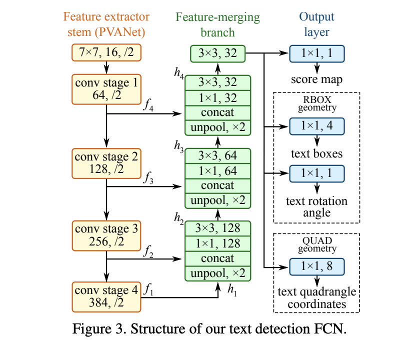

## EAST

[EAST: An Efficient and Accurate Scene Text Detector](https://arxiv.org/pdf/1704.03155.pdf)

### 结构

EAST是进行文本检测的一个比较常见的方法。其主要特点是快，并且可以检测倾斜的矩形框，或者四边形框。

EAST的主体结构是一个全卷积网络，其主要思路是进行像素级别的定位，通过一个U型网络，得到每一个像素点所对应的检测结果

- score map(c=1)：置信度
- RBOX(c=4+1)：这个点到预测的box的上下左右的距离，以及倾斜的角度
- QUAD(c=8)：四边形框，输出到4个定点的offer偏移量

### NMS

整体的网络思路也比较简单，后续因为每一个点都会出来一个框，所以NMS的开销比较大，这里作者也改进了NMS使用了locality-aware NMS。

文章基于

### 训练样本生成

由于EAST的网络结构的独特性，需要对每一个像素点进行ground truth的标注。

训练标签由两个部分组成，一个是score map的标签，一个是geometry map标签。
**注意：程序要求输入的四边形标定点是以顺时针方向标定的，这点很重要**

##### Score map 的生成

- 首先生成一个跟原图一样大的全为0的矩阵
- 根据标注的框进行缩小，缩小法则为每个点，找到与其相邻的最短边，然后缩小其$1/3$的长度
- 将缩小的框内标为1
- 再将整个score map缩小至原图的$1/4$，每隔4个像素采样（因为backbone出来的最后一层是$1/4$）

##### genmetry map的生成

- 首先生成一个跟原图一样大的5通道的矩阵
- 然后根据标注的8个坐标计算其符合标准的外接矩阵
- 计算到四条边的距离以及旋转的角度
- 填入矩阵中，并且每隔4个点进行采样，缩小至原图的$1/4 $ 

