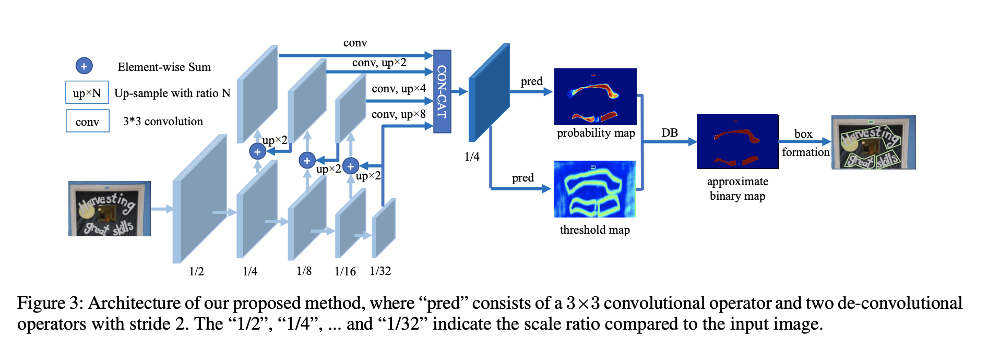

## Real-time Scene Text Detection with Differentiable Binarization

[白翔新作](https://arxiv.org/pdf/1911.08947.pdf)

通过设计了一个可微的二值化方程以及一个额外的threshhold branch来学习一个adaptive的threshhold map，使得不同的像素位置拥有不同的二值化阈值。

### Standard Binarization

$$
\begin{equation}  
B_{ij}=\left\{  
             \begin{array}{**lr**}  
             1, & P_{ij}<t \\  
             0, & else   
             \end{array}  
\right.  
\end{equation}
$$

### Differentiable Binarization

$$
\hat B_{ij}=\frac{1}{1+e^{-k(P_{ij}-T_{ij})}}
$$

这是一个类似sigmoid函数的修改形式，这个函数是可微分的，所以可以加入到整体的网站一起进行训练。

