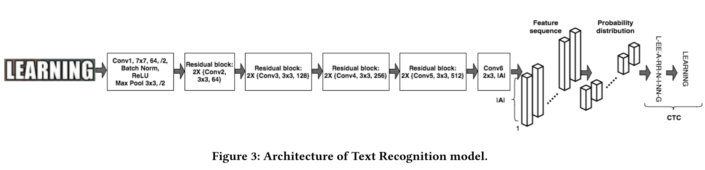
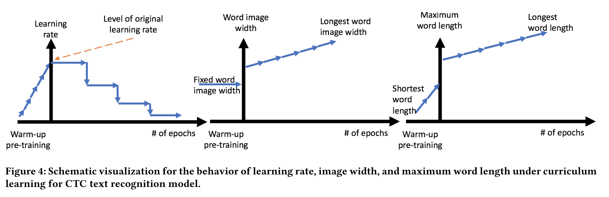

## Rosetta

[链接：Rosetta: Large scale system for text detection and recognition in images](https://arxiv.org/pdf/1910.05085.pdf)

facebook的OCR解决方案， 主要也是采用分段实现，进行检测+识别pipeline。

检测的框架FB用 的是faster-rcnn，使用了shuffleNet作backbone进行提速。

识别框架使用的是2014年提出的CHAR模型以及CTC模型，后续做了对比也证明了CTC相比CHAR更加有效。整个CTC模型的结构也是由CNN+FC实现的，并且没有使用LSTM做语义分析，整体结构比较简易。同时文章也指出其实CNN本身就具备分析这种语义的能力，去掉LSTM可以提速。

这里存个疑吧，毕竟大部分的文章还是证明了LSTM的有效性。

FB在训练的过程中提出了一些小trick可以借鉴一下：

- warm-up，学习率，这个比较常见
- warm-up阶段fix住输入图片的宽度上限（比较小），然后在warm-up结束之后逐步提升上限
- warm-up以及训阶段逐步提升输出词长的上限，随着训练的推进逐步增大
- 预处理阶段，**训练的时候**，不是硬性的把图片resize成32x100，而是软性的resize成32x128，即保持图片的尺寸比例，如果宽度不足128，就用白色去padding，如果长于128，则仍然扭曲图像。**测试的时候**，则是按照原尺寸进行高度为32的放缩，不去fix大小。
- 同时作者还发现，对图片做拉伸会使得效果有所提升（他们根据他们调参的结果，对所有cropped出来的图片进行了1.2倍的拉伸...）
- 先在artificial dataset上作pretrain，然后再使用真实指定的场景进行训练。

