# OCR-Corner论文阅读

## Title: [2018] Multi-Oriented Scene Text Detection via Corner Localization and Region Segmentation 

## 1 简介

作者提出了一种可端到端训练和评估的文本检测网络，结合了**目标检测**（DSSD）和**语义分割**两种思路。其中，主干网络使用了VGG16，主要用于进行特征提取；网络外接两个并行分支，第一个分支用来进行**边角点检测**来提取文本区域；第二个分支用类似RFCN的网格划分的思路做**位置敏感分割**。最后，使用NMS算法对候选文本区域进行过滤。

目标检测和语义分割的结合源于两种观察：

1. 不管矩形的尺寸是什么，长宽比或者矩形的角度是什么，它都可以被边角点唯一确定
2. 区域语义特征能够提供有效的文本位置信息

## 2 pipeline

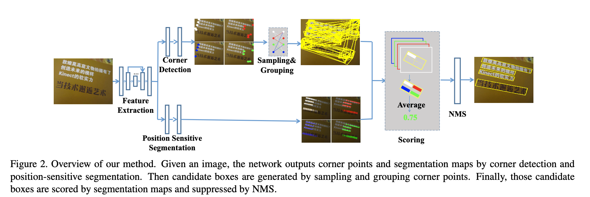

首先检测文本区域的边角点（上左，上右，下右，下左）而不是直接检测文本框。除此之外，预测位置语义分割map,而不是直接预测文本/非文本区域。最后，通过采样和组合检测边角点生成候选生成候选的bounding box，并通过语义信息估计不可能的bounding box。整条pipeline描述在fig2中。

## 3 优点

1. 通过采样和组合边角点来检测区域文本，能够处理任意方向的文本
2. 检测边角点而不是bounding box避免了长宽比剧烈变化的问题
3. 位置语义分割可以较好的分割出文本实例，无论是字符级别、单词级别或文本行级别
4. 候选框的边界决定于边角点，与从anchor或文本区域中回归文本框相比，文本框更加准确，特别是长文本

## 4 贡献

1. 提出了一种包含目标检测和语义分割功能的新的场景文本检测器，可以实现端到端训练和评估。

2. 基于位置敏感的ROI pooling，提出了一种旋转的位置敏感ROI average pooling层，能够处理任意方向的传播

3. 可以应用处理先前方法效果不好的**多方向**场景文本

4. 在准确率和性能上都表现的更好

## 5 网络

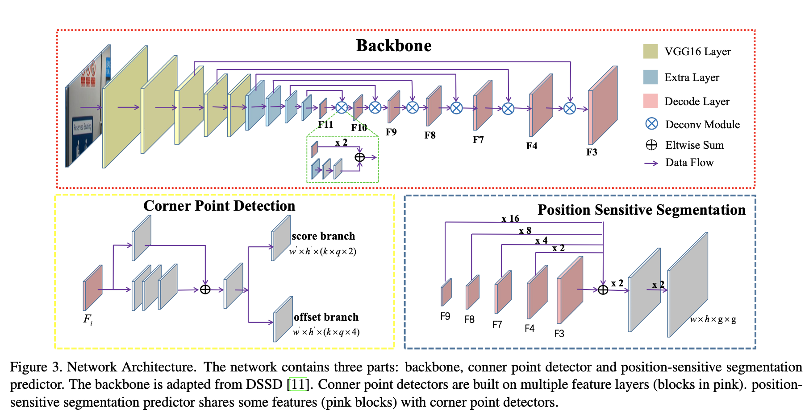

该网络是一种全卷积网络（FCN），起到特征提取，边角点检测和位置敏感语义分割的作用。

### 5.1 feature extraction

主干网络为预训练的VGG16，同时考虑：

1. 场景文本的尺寸变化剧烈，主干网络必须有足够强的能力来处理好这个问题
2. 自然场景中的背景复杂，因此特征必须包含足够多的信息。参考FPN和DSSD算法对这些问题的良好解决，所以采用在FPN/DSSD架构中扩展特征 

因此，将VGG16中的fc6和fc7层换成conv6和conv7层。同时又在conv7后面叠加了一些额外的卷积层(conv8-conv11)，来扩大感受野，增强特征提取的能力。

然后，在从上到下的路径上使用了DSSD中提出的一系列的反卷积模块，如fig3所示。特别，为了使用不同尺寸的文本区域，从conv11到conv3总共串联了6个反卷积模块，包含256个通道。为方便表示，将卷积层对应的特征表示为Fi，例如conv11的特征表示为F11。最后，通过conv11和反卷积模块来扩展特征，这样一来，就有了丰富的特征表示，可以更好的进行边角点检测和位置语义map预测。

### 5.2 corner detection

对于一个给定的旋转矩形bounding box R=(x, y, w, h, xita) ，它有4个边角点，可以表示为一组顺时针的二维坐标{(x1, y1), (x2, y2), (x3, y3), (x4, y4)}。

为了方便表示，作者使用一个水平正方形C=(xc, yc, ss, ss)重定义和表示了边角点，其中xc, yc 是边角点（例如左上边角点），也是水平正方形的中心。ss是旋转矩形bounding box R的短边长度

参考SSD和DSSD，本文也是用default boxes检测角点。但不同于DSSD或SSD中每个默认box输出分类分数和相对候选box偏移量的方式，边角点检测更加复杂。因为可能在一个相同位置出现不止一个边角点（例如在一个位置可能同时有下左和上右边角点box）。因此，一个default box应该输出分类分数和对应于4类边角点的4个候选框偏移量。

预测模块在一次卷积过程的两个分支分别**预测分数**和**偏移量**。对于一个大小为mxn的特征图，在每个单元中有k个box。对每个box，分数分支和偏移量分支输出2个分数和4个偏移量。分数分支中2代表该位置是否为边角点。因此，输出通道的分数分支和偏移量分支大小为 k x q x 2和k x q x 4，其中q代表边角点的类型，默认是4。

在训练阶段，遵从SSD中默认box和真实box的匹配策略。为了适应不同尺寸下的场景文本，在多种特征图下使用多种尺寸的默认box。默认的高宽比设置为1

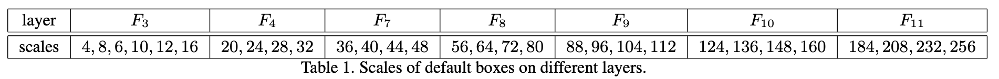

### 5.3 position-sensitive segmentation

以往单独使用语义分割检测文本的方法中，文本区域在分数图中总是不能够彼此分开，结果就是导致文本区域的重叠和文本像素的错误预测，需要进行复杂的后处理。

本文做法：对于一个文本bounding box R ,将其分为g x g的多个单元网格（例如，对于一个2*2的网格，一个文本区域能够被分割为4个单元，分别是上左，上右，下右，下左）。对于每个单元，分割图都被用于表示该像素是否属于该单元。

具体实现：F3后，经过两次Conv1x1- BN-ReLU-Deconv2x2  blocks，在最后的反卷积层上，使用g x g的卷积核，最后的特征敏感分割图具有g x g的通道数,本文g为2.

## 6 Label Genration

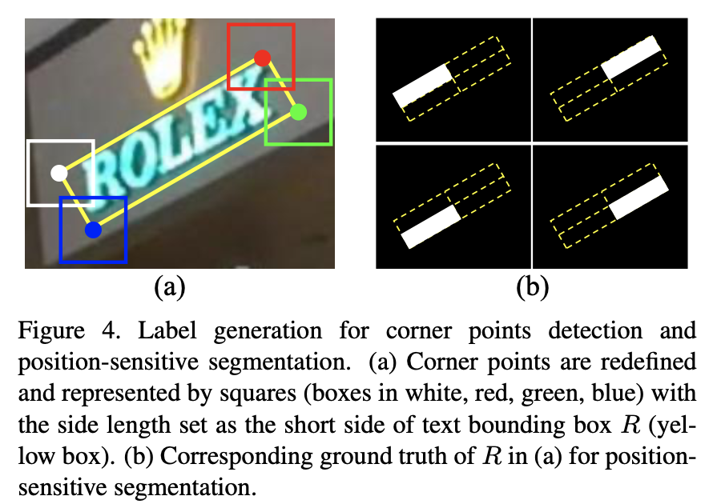

a. corner points

首先，将真实样本的每个文本框转化为覆盖最小文本框区域的矩形，然后，设置相对位置和4个边角点。

以下规则来设置一个旋转矩形的相对位置：

1) 上左，下左边角点的x坐标必须小于上右，下右边角点的x坐标

2) 上左，上右边角点的y坐标必须小于下左，下右边角点的y坐标

记为旋转矩形R={Pi|i属于{1,2,3,4}}，其中Pi=(xi, yi)是旋转矩形在上左，上右，下右和下左边角点。

b. Pixel-wise masks

使用pixel-wise标记R中文本和非文本。首先使用与输入图片相同的尺寸并设置所有的像素值为0来初始化4个标记。然后将R分成2 x 2的规则网格单元，形成4个单元，并将每个单元分给一个标记，例如上左单元分给第一个标记。然后，我们设置这些单元中的所有像素的值为1。

## 7 Optimization

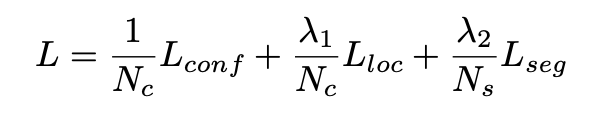

Nc:正例default box数

Ns:语义分割中的像素数

λ1 ：1

λ2 

### 7.1 Lconf 得分损失函数

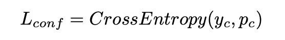

yc:为default boxes，正样本为1，其他为0

pc：预测得分

正负样本平衡：在线负样本挖掘来平衡训练样本，正负比例为1：3

### 7.2 Lloc 偏移量损失

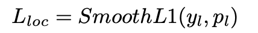

### 7.3 position-sensitive segmentation损失

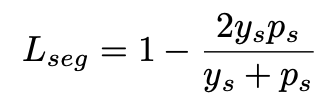

ys:为label

ps：为预测

## 8 Inference

### 8.1 sampling and grouping

在前向传播阶段，很多带有预测位置、短边长度和置信度的的边角点被产生出来。具有高分数（默认超过0.5为高分数）的点被保留。在经过NMS之后，包含4个边角点的集合可以通过相对位置信息**组合**而得到。

理论上说：

旋转矩阵 = 两个点 + 一个与其垂直的边

对于一个预测点，短边已知（ss），可以通过采样和组合一个边角点集合中的两个来直接构建一个旋转矩阵，例如：上左，上右），（上右，下右），（下左，下右），（下左，上左）

前置规则过滤不合适的边角点对：

1. 保证位置关系，例如上左的x必须小于上右的的x坐标位置
2. 已构建的旋转矩形的最短边必须高于阈值（默认为5）
3. 成对的两点预测出的短边ss1和ss2必须满足：

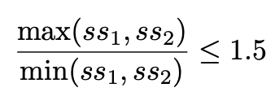

### 8.2 scoring

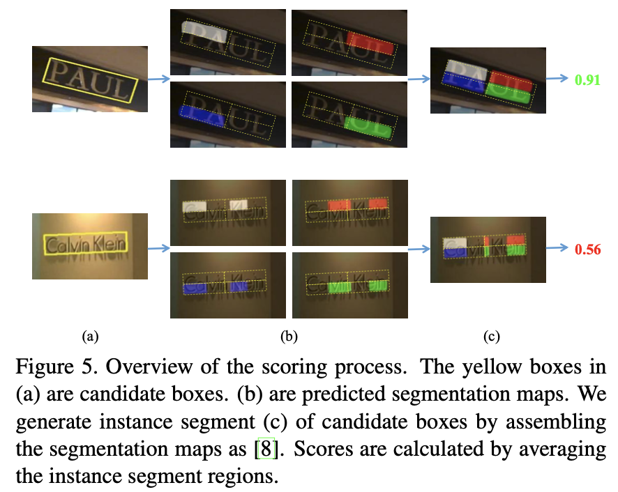

在采样和组合边角点以后，会生成大量的候选bounding box，通过位置敏感分割图给候选bounding box赋予分数。

为了处理旋转文本bounding box，本文采用改进的**Rotated Position-Sensitive ROI Average pooling layer**。对于一个旋转的box，先将该box分割为g x g个单元，然后对每个单元创建一个最小覆盖矩形（we generate a rectangle for each bin with the minimum area to cover the bin ）。对该单元中的所有像素重复该步骤，并计算所有像素的最小覆盖矩形的均值。最后，旋转bounding box的分数就是g x g单元中的分数均值

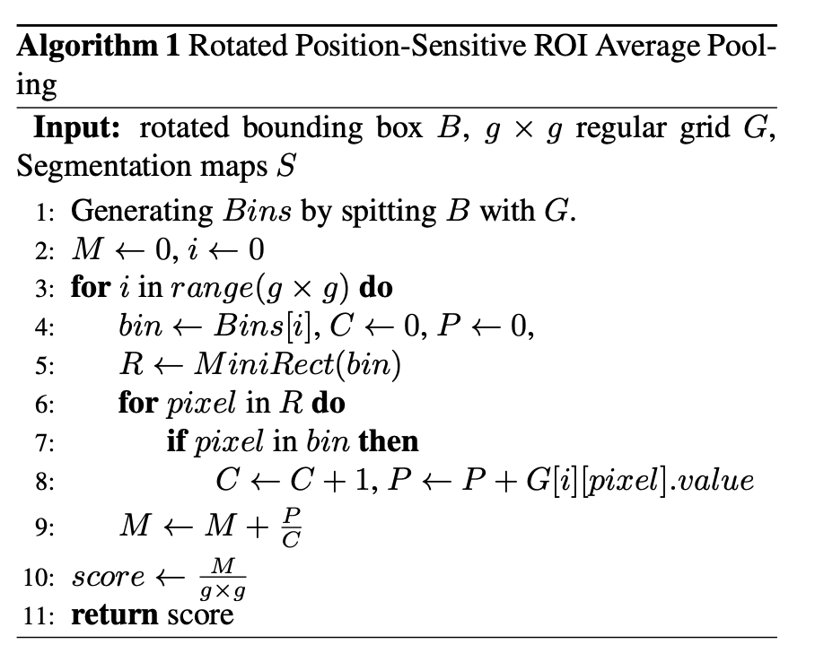

 低分数的候选box会被过滤掉，阈值τ默认为0.6.

## 9 局限

1. 当两个文本很接近，可能把两个文本预测为一个，因为位置敏感分割可能失效
2. 在扭曲文本上检测较差

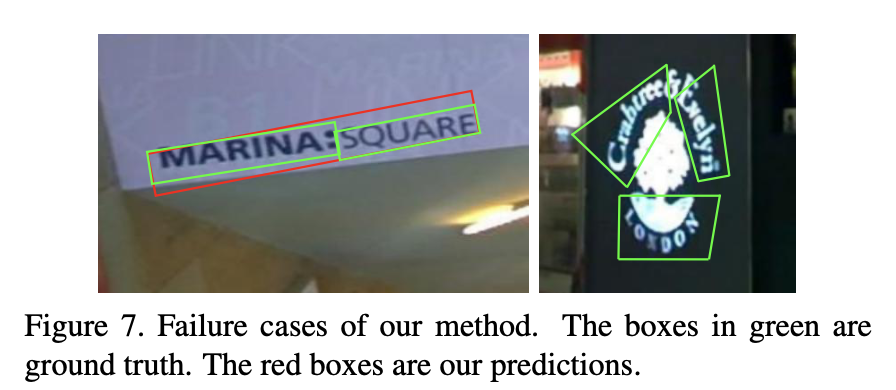

